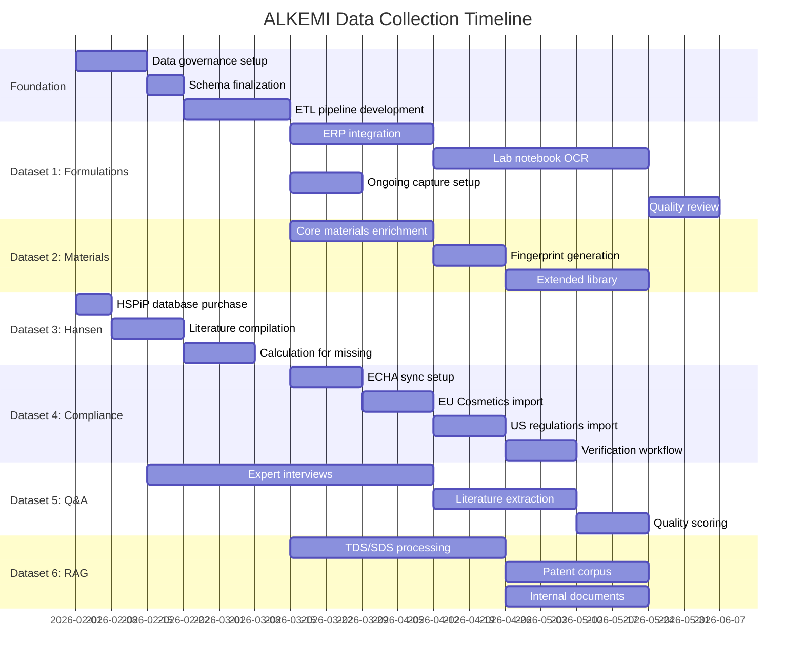

# ALKEMI™ Training Data Collection Plan

**Version:** 1.0  
**Date:** January 22, 2026  
**Purpose:** Specification for curating AI-optimized training datasets to improve ALKEMI platform accuracy  
**Target Improvement:** +20-30% prediction accuracy, +15% chemist trust score

---

## Executive Summary

This document specifies **six priority datasets** that will significantly improve ALKEMI's performance for R&D engineers:

| # | Dataset | Collection Effort | Impact | Priority |
|---|---------|------------------|--------|----------|
| 1 | Formulation-Outcome Database | 3 months | Very High | P0 |
| 2 | Material Properties Library | 2 months | High | P0 |
| 3 | Hansen Solubility Parameters | 1 month | High | P1 |
| 4 | Regulatory Compliance Database | 2 months | High | P1 |
| 5 | Chemistry Q&A Fine-Tuning Set | 3 months | Medium | P2 |
| 6 | Document Corpus for RAG | Ongoing | Medium | P2 |

**Total Investment:** ~₹50-80 lakhs (internal effort + data purchases)  
**Expected ROI:** 40-60% reduction in formulation development time

---

## Table of Contents

1. [Dataset 1: Formulation-Outcome Database](#dataset-1-formulation-outcome-database)
2. [Dataset 2: Material Properties Library](#dataset-2-material-properties-library)
3. [Dataset 3: Hansen Solubility Parameters](#dataset-3-hansen-solubility-parameters)
4. [Dataset 4: Regulatory Compliance Database](#dataset-4-regulatory-compliance-database)
5. [Dataset 5: Chemistry Q&A Fine-Tuning Set](#dataset-5-chemistry-qa-fine-tuning-set)
6. [Dataset 6: Document Corpus for RAG](#dataset-6-document-corpus-for-rag)
7. [Data Quality Framework](#data-quality-framework)
8. [Collection Timeline](#collection-timeline)
9. [Data Governance](#data-governance)
10. [Appendix: Schema Definitions](#appendix-schema-definitions)

---

## Dataset 1: Formulation-Outcome Database

### Purpose
Train ML models to predict formulation properties based on composition and test conditions. This is the **single most valuable dataset** for ALKEMI.

### Target Size
- **Minimum Viable:** 1,000 formulation-outcome records
- **Ideal:** 10,000+ records
- **Per domain:** At least 500 records for each chemistry domain (UV Inks, Coatings, etc.)

### Schema Definition

```json
{
  "$schema": "https://json-schema.org/draft/2020-12/schema",
  "title": "FormulationOutcomeRecord",
  "type": "object",
  "required": ["formulation_id", "ingredients", "test_conditions", "measured_properties", "metadata"],
  "properties": {
    "formulation_id": {
      "type": "string",
      "description": "Unique identifier (e.g., UV-BLK-2024-001)",
      "pattern": "^[A-Z]{2,4}-[A-Z]{2,4}-\\d{4}-\\d{3,4}$"
    },
    "formulation_name": {
      "type": "string",
      "description": "Human-readable name"
    },
    "domain": {
      "type": "string",
      "enum": ["uv_ink", "uv_coating", "solvent_ink", "water_based", "adhesive", "sealant", "personal_care"]
    },
    "application": {
      "type": "string",
      "description": "End use (e.g., 'flexo_packaging', 'offset_commercial', 'wood_coating')"
    },
    "ingredients": {
      "type": "array",
      "minItems": 2,
      "items": {
        "type": "object",
        "required": ["material_name", "percentage"],
        "properties": {
          "material_name": {"type": "string"},
          "material_code": {"type": "string", "description": "Internal material code"},
          "cas_number": {"type": "string", "pattern": "^\\d{2,7}-\\d{2}-\\d$"},
          "percentage": {"type": "number", "minimum": 0, "maximum": 100},
          "function": {
            "type": "string",
            "enum": ["oligomer", "monomer", "photoinitiator", "pigment", "additive", "solvent", "resin", "filler", "catalyst", "stabilizer", "surfactant", "other"]
          },
          "supplier": {"type": "string"},
          "grade": {"type": "string"},
          "lot_number": {"type": "string"}
        }
      }
    },
    "test_conditions": {
      "type": "object",
      "description": "Conditions under which properties were measured",
      "properties": {
        "temperature_c": {"type": "number"},
        "humidity_pct": {"type": "number", "minimum": 0, "maximum": 100},
        "shear_rate_s1": {"type": "number"},
        "spindle_type": {"type": "string"},
        "cure_lamp_type": {"type": "string", "enum": ["mercury_h", "mercury_d", "led_395", "led_385", "led_365", "gallium", "iron"]},
        "cure_energy_mj_cm2": {"type": "number"},
        "cure_speed_mpm": {"type": "number"},
        "film_thickness_um": {"type": "number"},
        "substrate_type": {"type": "string"},
        "substrate_treatment": {"type": "string", "enum": ["none", "corona", "flame", "plasma", "primer"]},
        "aging_days": {"type": "integer"},
        "aging_conditions": {"type": "string"}
      }
    },
    "measured_properties": {
      "type": "object",
      "description": "Actual lab measurements",
      "properties": {
        "viscosity_cps": {"type": "number"},
        "viscosity_method": {"type": "string"},
        "density_g_cm3": {"type": "number"},
        "ph": {"type": "number"},
        "cure_speed_mpm": {"type": "number"},
        "adhesion_rating": {"type": "string", "enum": ["0B", "1B", "2B", "3B", "4B", "5B"]},
        "adhesion_method": {"type": "string", "enum": ["crosshatch", "tape_pull", "peel_90"]},
        "hardness_pencil": {"type": "string", "pattern": "^[0-9]?[BHF]$"},
        "hardness_konig_s": {"type": "number"},
        "hardness_persoz_s": {"type": "number"},
        "gloss_20deg": {"type": "number"},
        "gloss_60deg": {"type": "number"},
        "gloss_85deg": {"type": "number"},
        "color_l": {"type": "number"},
        "color_a": {"type": "number"},
        "color_b": {"type": "number"},
        "delta_e": {"type": "number"},
        "opacity_pct": {"type": "number"},
        "flexibility_mandrel_mm": {"type": "number"},
        "impact_resistance_kg_cm": {"type": "number"},
        "mar_resistance_rating": {"type": "integer", "minimum": 1, "maximum": 5},
        "chemical_resistance": {"type": "object"},
        "weathering_hours": {"type": "number"},
        "weathering_result": {"type": "string"},
        "voc_g_l": {"type": "number"},
        "solids_pct": {"type": "number"},
        "pot_life_hours": {"type": "number"},
        "shelf_life_months": {"type": "number"},
        "custom_properties": {"type": "object"}
      }
    },
    "outcome": {
      "type": "object",
      "properties": {
        "status": {"type": "string", "enum": ["pass", "fail", "conditional_pass", "pending"]},
        "failure_modes": {
          "type": "array",
          "items": {"type": "string"}
        },
        "failure_root_cause": {"type": "string"},
        "corrective_action": {"type": "string"},
        "next_iteration": {"type": "string", "description": "Link to next formulation version"}
      }
    },
    "metadata": {
      "type": "object",
      "required": ["source", "created_date"],
      "properties": {
        "source": {"type": "string", "enum": ["lab_notebook", "erp", "lims", "manual_entry", "ocr_extraction"]},
        "source_reference": {"type": "string", "description": "Lab notebook page, ERP batch number, etc."},
        "created_date": {"type": "string", "format": "date"},
        "created_by": {"type": "string"},
        "verified_by": {"type": "string"},
        "verified_date": {"type": "string", "format": "date"},
        "confidence_score": {"type": "number", "minimum": 0, "maximum": 1},
        "data_quality_flags": {"type": "array", "items": {"type": "string"}},
        "organization_id": {"type": "string"},
        "project_code": {"type": "string"},
        "customer_code": {"type": "string"},
        "is_confidential": {"type": "boolean"}
      }
    }
  }
}
```

### Data Collection Sources

| Source | Records Est. | Quality | Effort | Notes |
|--------|--------------|---------|--------|-------|
| **Lab Notebooks (Historical)** | 2,000-5,000 | Medium | High | OCR + LLM extraction |
| **ERP/LIMS Records** | 1,000-3,000 | High | Medium | API integration |
| **QC Database** | 500-1,000 | High | Low | Direct export |
| **Ongoing Lab Work** | 50-100/month | High | Low | Real-time capture |
| **Customer Trial Reports** | 200-500 | Medium | Medium | PDF extraction |

### Collection Methodology

#### Phase 1: ERP/LIMS Integration (Weeks 1-4)
```python
# ETL Pipeline for ERP Data
class ERPFormulationExtractor:
    def extract_batch(self, batch_id: str) -> FormulationOutcomeRecord:
        """
        Extract formulation data from ERP batch record.
        
        Steps:
        1. Query ERP for batch master data
        2. Get BOM (Bill of Materials) for ingredients
        3. Get QC results for measured properties
        4. Map ERP fields to ALKEMI schema
        5. Validate and flag data quality issues
        """
        batch = self.erp.get_batch(batch_id)
        bom = self.erp.get_bom(batch.formula_id)
        qc_results = self.erp.get_qc_results(batch_id)
        
        record = FormulationOutcomeRecord(
            formulation_id=self._generate_id(batch),
            ingredients=self._map_bom_to_ingredients(bom),
            test_conditions=self._extract_test_conditions(qc_results),
            measured_properties=self._map_qc_to_properties(qc_results),
            outcome=self._determine_outcome(qc_results),
            metadata=self._build_metadata(batch, "erp")
        )
        
        return self._validate_and_flag(record)
```

#### Phase 2: Lab Notebook OCR (Weeks 5-10)
```python
# LLM-Assisted Lab Notebook Extraction
class LabNotebookExtractor:
    def __init__(self):
        self.ocr = DocumentOCR()
        self.llm = AnthropicClient(model="claude-sonnet-4-5")
    
    def extract_from_scan(self, image_path: str) -> list[FormulationOutcomeRecord]:
        """
        Extract formulation data from scanned lab notebook page.
        """
        # Step 1: OCR the page
        text = self.ocr.extract_text(image_path)
        
        # Step 2: LLM extraction with schema guidance
        prompt = f"""
        Extract formulation data from this lab notebook page.
        
        OCR Text:
        {text}
        
        Extract ALL formulations mentioned. For each, provide:
        1. Formulation ID or name
        2. All ingredients with percentages
        3. Test conditions (temperature, equipment, etc.)
        4. Measured properties (viscosity, adhesion, etc.)
        5. Pass/fail outcome and any notes
        
        Return as JSON array matching this schema:
        {FORMULATION_SCHEMA}
        
        If any field is unclear, set confidence_score lower and add to data_quality_flags.
        """
        
        response = self.llm.complete(prompt)
        records = json.loads(response)
        
        # Step 3: Validate and flag for human review
        return [self._validate_and_flag(r, source="ocr_extraction") for r in records]
```

#### Phase 3: Ongoing Capture (Continuous)
```typescript
// Real-time capture in ALKEMI UI
interface TrialEntryForm {
  // Auto-populated from formulation
  formulation_id: string;
  ingredients: Ingredient[];
  
  // Chemist enters test conditions
  test_conditions: {
    temperature_c: number;
    shear_rate_s1: number;
    // ... other conditions from test_condition_types
  };
  
  // Chemist enters results
  measured_properties: {
    viscosity_cps: number;
    adhesion_rating: AdhesionRating;
    // ... other properties
  };
  
  // Chemist evaluates outcome
  outcome: {
    status: 'pass' | 'fail' | 'conditional_pass';
    failure_modes?: string[];
    notes?: string;
  };
}

// On save, automatically add to training dataset
async function saveTrialAndUpdateTrainingData(trial: TrialEntryForm) {
  // Save to trials table
  const trialId = await db.trials.create(trial);
  
  // Convert to training record format
  const trainingRecord = convertToTrainingFormat(trial);
  
  // Add to training dataset (pending verification)
  await db.training_formulation_outcomes.create({
    ...trainingRecord,
    metadata: {
      source: 'real_time_capture',
      created_date: new Date(),
      created_by: currentUser.id,
      confidence_score: 0.95, // High confidence for direct entry
      verification_status: 'pending'
    }
  });
}
```

### Data Quality Requirements

| Field | Required | Validation | Quality Flag If |
|-------|----------|------------|-----------------|
| formulation_id | Yes | Unique, pattern match | - |
| ingredients | Yes | Sum = 100% ± 0.5% | Sum deviation > 0.5% |
| ingredients[].cas_number | Preferred | Valid CAS format | Missing CAS |
| test_conditions.temperature_c | Yes | -50 to 300 | Outside range or missing |
| measured_properties | Min 3 | Numeric, reasonable range | < 3 properties |
| outcome.status | Yes | Enum value | - |
| metadata.source | Yes | Enum value | - |

### Train/Test Split Strategy

```python
def create_train_test_split(records: list[FormulationOutcomeRecord]) -> dict:
    """
    Create stratified train/test split ensuring:
    1. No data leakage (same formulation family in one split)
    2. Balanced domains
    3. Temporal holdout (recent data in test)
    """
    # Group by formulation family
    families = group_by_family(records)
    
    # Stratify by domain
    by_domain = defaultdict(list)
    for family_id, family_records in families.items():
        domain = family_records[0].domain
        by_domain[domain].append((family_id, family_records))
    
    train, test = [], []
    
    for domain, families in by_domain.items():
        # Sort by date (oldest first)
        families.sort(key=lambda x: min(r.metadata.created_date for r in x[1]))
        
        # 80% train, 20% test (by family count)
        split_idx = int(len(families) * 0.8)
        
        for family_id, family_records in families[:split_idx]:
            train.extend(family_records)
        for family_id, family_records in families[split_idx:]:
            test.extend(family_records)
    
    return {
        "train": train,
        "test": test,
        "train_count": len(train),
        "test_count": len(test),
        "domains": {d: {"train": len([r for r in train if r.domain == d]),
                       "test": len([r for r in test if r.domain == d])}
                   for d in by_domain.keys()}
    }
```

### Expected Outcomes

| Metric | Before Dataset | After Dataset |
|--------|----------------|---------------|
| Property prediction RMSE | 15-20% | 8-12% |
| Prediction confidence calibration | Poor | Well-calibrated |
| Cold-start capability | None | Basic predictions from day 1 |
| Failure mode prediction | Not possible | 70%+ accuracy |

---

## Dataset 2: Material Properties Library

### Purpose
Provide structured material data for physics models, similarity calculations, and formulation suggestions.

### Target Size
- **Core materials:** 500-1,000 materials used frequently
- **Extended library:** 5,000-10,000 materials
- **Per material:** 15-30 properties minimum

### Schema Definition

```json
{
  "$schema": "https://json-schema.org/draft/2020-12/schema",
  "title": "MaterialRecord",
  "type": "object",
  "required": ["material_id", "name", "cas_number", "category", "basic_properties"],
  "properties": {
    "material_id": {"type": "string"},
    "name": {"type": "string"},
    "synonyms": {"type": "array", "items": {"type": "string"}},
    "cas_number": {"type": "string"},
    "ec_number": {"type": "string"},
    "molecular_formula": {"type": "string"},
    "molecular_weight": {"type": "number"},
    "smiles": {"type": "string"},
    "inchi": {"type": "string"},
    "inchi_key": {"type": "string"},
    
    "category": {
      "type": "string",
      "enum": ["oligomer", "monomer", "photoinitiator", "pigment", "additive", "solvent", "resin", "filler", "catalyst", "stabilizer", "surfactant", "wax", "other"]
    },
    "subcategory": {"type": "string"},
    "chemical_class": {"type": "string"},
    
    "basic_properties": {
      "type": "object",
      "properties": {
        "physical_state": {"type": "string", "enum": ["solid", "liquid", "gas", "paste"]},
        "color": {"type": "string"},
        "odor": {"type": "string"},
        "density_g_cm3": {"type": "number"},
        "density_temp_c": {"type": "number"},
        "melting_point_c": {"type": "number"},
        "boiling_point_c": {"type": "number"},
        "flash_point_c": {"type": "number"},
        "vapor_pressure_mmhg": {"type": "number"},
        "vapor_pressure_temp_c": {"type": "number"},
        "water_solubility_g_l": {"type": "number"},
        "log_p": {"type": "number"},
        "refractive_index": {"type": "number"}
      }
    },
    
    "viscosity_data": {
      "type": "object",
      "description": "Viscosity at multiple temperatures for curve fitting",
      "properties": {
        "measurements": {
          "type": "array",
          "items": {
            "type": "object",
            "properties": {
              "temperature_c": {"type": "number"},
              "viscosity_cps": {"type": "number"},
              "shear_rate_s1": {"type": "number"},
              "method": {"type": "string"}
            }
          }
        },
        "arrhenius_a": {"type": "number", "description": "Pre-exponential factor"},
        "arrhenius_ea": {"type": "number", "description": "Activation energy (kJ/mol)"},
        "is_newtonian": {"type": "boolean"}
      }
    },
    
    "hansen_parameters": {
      "type": "object",
      "description": "Hansen Solubility Parameters",
      "properties": {
        "hansen_d": {"type": "number", "description": "Dispersion (MPa^0.5)"},
        "hansen_p": {"type": "number", "description": "Polar (MPa^0.5)"},
        "hansen_h": {"type": "number", "description": "Hydrogen bonding (MPa^0.5)"},
        "hansen_total": {"type": "number", "description": "Total (calculated)"},
        "molar_volume": {"type": "number", "description": "cm³/mol"},
        "source": {"type": "string"},
        "confidence": {"type": "string", "enum": ["measured", "calculated", "estimated"]}
      }
    },
    
    "uv_cure_properties": {
      "type": "object",
      "description": "For photoinitiators and UV-reactive materials",
      "properties": {
        "absorption_max_nm": {"type": "array", "items": {"type": "number"}},
        "molar_extinction_coefficient": {"type": "number"},
        "reactive_groups": {"type": "array", "items": {"type": "string"}},
        "functionality": {"type": "number", "description": "Number of reactive groups"},
        "equivalent_weight": {"type": "number"},
        "double_bond_equivalent": {"type": "number"},
        "photoinitiator_type": {"type": "string", "enum": ["type_1", "type_2", "hybrid"]},
        "yellowing_tendency": {"type": "string", "enum": ["low", "medium", "high"]},
        "migration_tendency": {"type": "string", "enum": ["low", "medium", "high"]}
      }
    },
    
    "polymer_properties": {
      "type": "object",
      "description": "For resins, oligomers, polymers",
      "properties": {
        "tg_c": {"type": "number", "description": "Glass transition temperature"},
        "molecular_weight_mn": {"type": "number"},
        "molecular_weight_mw": {"type": "number"},
        "polydispersity": {"type": "number"},
        "acid_number": {"type": "number"},
        "hydroxyl_number": {"type": "number"},
        "amine_number": {"type": "number"},
        "epoxy_equivalent_weight": {"type": "number"},
        "isocyanate_content_pct": {"type": "number"}
      }
    },
    
    "pigment_properties": {
      "type": "object",
      "description": "For pigments and colorants",
      "properties": {
        "color_index_name": {"type": "string"},
        "color_index_number": {"type": "string"},
        "particle_size_d50_um": {"type": "number"},
        "particle_size_d90_um": {"type": "number"},
        "oil_absorption_g_100g": {"type": "number"},
        "specific_surface_area_m2_g": {"type": "number"},
        "tinting_strength": {"type": "number"},
        "lightfastness_rating": {"type": "integer", "minimum": 1, "maximum": 8},
        "heat_stability_c": {"type": "number"}
      }
    },
    
    "molecular_fingerprint": {
      "type": "object",
      "description": "For similarity calculations",
      "properties": {
        "morgan_2048": {"type": "array", "items": {"type": "integer"}},
        "maccs_keys": {"type": "array", "items": {"type": "integer"}},
        "rdkit_fingerprint": {"type": "array", "items": {"type": "integer"}}
      }
    },
    
    "regulatory_status": {
      "type": "object",
      "properties": {
        "reach_registered": {"type": "boolean"},
        "reach_registration_number": {"type": "string"},
        "svhc_status": {"type": "boolean"},
        "tsca_listed": {"type": "boolean"},
        "fda_fcn_listed": {"type": "boolean"},
        "kosher_certified": {"type": "boolean"},
        "halal_certified": {"type": "boolean"},
        "vegan": {"type": "boolean"},
        "restrictions": {
          "type": "array",
          "items": {
            "type": "object",
            "properties": {
              "regulation": {"type": "string"},
              "restriction_type": {"type": "string"},
              "max_concentration_pct": {"type": "number"},
              "notes": {"type": "string"}
            }
          }
        }
      }
    },
    
    "supplier_info": {
      "type": "array",
      "items": {
        "type": "object",
        "properties": {
          "supplier_name": {"type": "string"},
          "product_name": {"type": "string"},
          "product_code": {"type": "string"},
          "grade": {"type": "string"},
          "packaging_options": {"type": "array", "items": {"type": "string"}},
          "price_per_kg_usd": {"type": "number"},
          "price_date": {"type": "string", "format": "date"},
          "lead_time_days": {"type": "integer"},
          "minimum_order_kg": {"type": "number"},
          "region_availability": {"type": "array", "items": {"type": "string"}}
        }
      }
    },
    
    "safety_data": {
      "type": "object",
      "properties": {
        "ghs_hazard_classes": {"type": "array", "items": {"type": "string"}},
        "ghs_pictograms": {"type": "array", "items": {"type": "string"}},
        "signal_word": {"type": "string", "enum": ["danger", "warning", "none"]},
        "h_statements": {"type": "array", "items": {"type": "string"}},
        "p_statements": {"type": "array", "items": {"type": "string"}},
        "ld50_oral_mg_kg": {"type": "number"},
        "ld50_dermal_mg_kg": {"type": "number"},
        "skin_sensitizer": {"type": "boolean"},
        "respiratory_sensitizer": {"type": "boolean"},
        "carcinogen_classification": {"type": "string"}
      }
    },
    
    "metadata": {
      "type": "object",
      "properties": {
        "source": {"type": "string"},
        "source_reference": {"type": "string"},
        "created_date": {"type": "string", "format": "date"},
        "updated_date": {"type": "string", "format": "date"},
        "verified_by": {"type": "string"},
        "data_quality_score": {"type": "number", "minimum": 0, "maximum": 1}
      }
    }
  }
}
```

### Data Collection Sources

| Source | Properties Available | Coverage | Cost |
|--------|---------------------|----------|------|
| **Supplier TDS** | Basic, viscosity, cure | 80% of needed | Free (extraction effort) |
| **Supplier SDS** | Safety, regulatory | 95% | Free |
| **PubChem** | Basic, molecular | 60% | Free API |
| **HSPiP Database** | Hansen parameters | 10,000 compounds | ~$2,000 |
| **ChemSpider** | Molecular, basic | 70M compounds | Free API |
| **Internal Testing** | All properties | 100% for tested | Existing data |

### Collection Pipeline

```python
# Material Data Enrichment Pipeline

class MaterialEnrichmentPipeline:
    def __init__(self):
        self.pubchem = PubChemClient()
        self.rdkit = RDKitProcessor()
        self.tds_extractor = TDSExtractor()
        self.sds_extractor = SDSExtractor()
    
    async def enrich_material(self, material: MaterialRecord) -> MaterialRecord:
        """
        Enrich material record from multiple sources.
        """
        # Step 1: Get molecular info from PubChem
        if material.cas_number:
            pubchem_data = await self.pubchem.get_by_cas(material.cas_number)
            material.smiles = pubchem_data.get('smiles')
            material.molecular_formula = pubchem_data.get('molecular_formula')
            material.molecular_weight = pubchem_data.get('molecular_weight')
        
        # Step 2: Generate fingerprints from SMILES
        if material.smiles:
            mol = self.rdkit.mol_from_smiles(material.smiles)
            material.molecular_fingerprint = {
                'morgan_2048': self.rdkit.morgan_fingerprint(mol, radius=2, bits=2048),
                'maccs_keys': self.rdkit.maccs_keys(mol)
            }
        
        # Step 3: Extract from TDS if available
        if material.tds_document_id:
            tds_data = await self.tds_extractor.extract(material.tds_document_id)
            material.viscosity_data = tds_data.get('viscosity_data')
            material.basic_properties.update(tds_data.get('basic_properties', {}))
        
        # Step 4: Extract from SDS if available
        if material.sds_document_id:
            sds_data = await self.sds_extractor.extract(material.sds_document_id)
            material.safety_data = sds_data.get('safety_data')
            material.regulatory_status.update(sds_data.get('regulatory', {}))
        
        # Step 5: Calculate Hansen if not available
        if not material.hansen_parameters and material.smiles:
            material.hansen_parameters = self.estimate_hansen(material.smiles)
            material.hansen_parameters['confidence'] = 'calculated'
        
        # Step 6: Calculate data quality score
        material.metadata.data_quality_score = self.calculate_quality_score(material)
        
        return material
    
    def calculate_quality_score(self, material: MaterialRecord) -> float:
        """
        Score based on completeness and source quality.
        """
        scores = []
        
        # Basic properties (0.3 weight)
        basic_fields = ['density_g_cm3', 'melting_point_c', 'flash_point_c']
        basic_complete = sum(1 for f in basic_fields if getattr(material.basic_properties, f, None))
        scores.append(0.3 * basic_complete / len(basic_fields))
        
        # Hansen parameters (0.2 weight)
        if material.hansen_parameters:
            confidence_score = {'measured': 1.0, 'calculated': 0.7, 'estimated': 0.4}
            scores.append(0.2 * confidence_score.get(material.hansen_parameters.get('confidence'), 0.3))
        
        # Viscosity data (0.2 weight)
        if material.viscosity_data and len(material.viscosity_data.get('measurements', [])) >= 3:
            scores.append(0.2)
        
        # Fingerprint (0.1 weight)
        if material.molecular_fingerprint:
            scores.append(0.1)
        
        # Safety data (0.1 weight)
        if material.safety_data and material.safety_data.get('ghs_hazard_classes'):
            scores.append(0.1)
        
        # Regulatory status (0.1 weight)
        if material.regulatory_status and material.regulatory_status.get('reach_registered') is not None:
            scores.append(0.1)
        
        return sum(scores)
```

### Priority Materials

**Tier 1 (Must Have) - 200 materials:**
- All oligomers in current formulations
- All monomers in current formulations
- All photoinitiators
- Top 50 additives by usage

**Tier 2 (Should Have) - 500 materials:**
- Alternative suppliers for Tier 1
- Pigments and colorants
- Specialty additives

**Tier 3 (Nice to Have) - 1,000+ materials:**
- Competitive materials
- Emerging chemistries
- Legacy materials

---

## Dataset 3: Hansen Solubility Parameters

### Purpose
Enable solubility/compatibility predictions between materials. Critical for formulation feasibility checks.

### Why This Matters

```
Without Hansen parameters:
- LLM: "These materials should be compatible" (guess)

With Hansen parameters:
- Physics: Hansen distance = 4.2 < 8 → Compatible ✓
- Physics: Hansen distance = 12.5 > 8 → Incompatible ✗
```

### Target Coverage
- **All internal materials:** 100%
- **Common industry materials:** 5,000+
- **Confidence:** >80% measured or calculated (not estimated)

### Schema

```json
{
  "cas_number": "123-45-6",
  "name": "Material Name",
  "hansen_d": 17.8,
  "hansen_p": 4.2,
  "hansen_h": 6.1,
  "hansen_total": 19.2,
  "molar_volume_cm3_mol": 285.3,
  "source": "HSPiP_v5",
  "method": "measured | group_contribution | regression",
  "confidence": "high | medium | low",
  "temperature_c": 25,
  "notes": "Optional notes"
}
```

### Data Sources

| Source | Coverage | Quality | Cost | Effort |
|--------|----------|---------|------|--------|
| **HSPiP Database** | 10,000 compounds | High (measured) | $2,000 | 1 day |
| **Literature compilation** | 5,000 compounds | Medium | Free | 2 weeks |
| **Group contribution calculation** | Unlimited | Medium | Free (RDKit) | Setup only |
| **Supplier data** | 500 compounds | High | Free | 1 week |

### Calculation Methods

```python
# Hansen Parameter Estimation from SMILES

from rdkit import Chem
from rdkit.Chem import Descriptors, rdMolDescriptors

class HansenCalculator:
    """
    Calculate Hansen Solubility Parameters using group contribution methods.
    """
    
    # Group contribution values (Hoftyzer-Van Krevelen method)
    GROUP_CONTRIBUTIONS = {
        # Fragment: (Fd, Fp², Fh)
        '-CH3': (420, 0, 0),
        '-CH2-': (270, 0, 0),
        '>CH-': (80, 0, 0),
        '>C<': (-70, 0, 0),
        '=CH2': (400, 0, 0),
        '=CH-': (200, 0, 0),
        '=C<': (70, 0, 0),
        '-C≡C-': (550, 160000, 1500),
        'phenyl': (1430, 110000, 0),
        '-O-': (100, 160000, 3000),
        '-OH': (210, 250000, 20000),
        '-CO-': (290, 770000, 2000),
        '-COO-': (390, 490000, 7000),
        '-COOH': (530, 420000, 10000),
        # ... more groups
    }
    
    def calculate_from_smiles(self, smiles: str) -> dict:
        """
        Estimate Hansen parameters from molecular structure.
        """
        mol = Chem.MolFromSmiles(smiles)
        if not mol:
            return None
        
        # Get molar volume (Fedors method)
        molar_volume = self._estimate_molar_volume(mol)
        
        # Count functional groups
        groups = self._identify_groups(mol)
        
        # Sum group contributions
        sum_fd = sum(self.GROUP_CONTRIBUTIONS.get(g, (0,0,0))[0] * count 
                     for g, count in groups.items())
        sum_fp2 = sum(self.GROUP_CONTRIBUTIONS.get(g, (0,0,0))[1] * count 
                      for g, count in groups.items())
        sum_fh = sum(self.GROUP_CONTRIBUTIONS.get(g, (0,0,0))[2] * count 
                     for g, count in groups.items())
        
        # Calculate parameters
        delta_d = sum_fd / molar_volume
        delta_p = (sum_fp2 ** 0.5) / molar_volume
        delta_h = (sum_fh / molar_volume) ** 0.5
        delta_total = (delta_d**2 + delta_p**2 + delta_h**2) ** 0.5
        
        return {
            'hansen_d': round(delta_d, 1),
            'hansen_p': round(delta_p, 1),
            'hansen_h': round(delta_h, 1),
            'hansen_total': round(delta_total, 1),
            'molar_volume_cm3_mol': round(molar_volume, 1),
            'method': 'group_contribution',
            'confidence': 'medium'
        }
    
    def hansen_distance(self, material1: dict, material2: dict) -> float:
        """
        Calculate Hansen distance (Ra) between two materials.
        Ra < 8: Compatible
        Ra > 8: Likely incompatible
        """
        return (
            4 * (material1['hansen_d'] - material2['hansen_d'])**2 +
            (material1['hansen_p'] - material2['hansen_p'])**2 +
            (material1['hansen_h'] - material2['hansen_h'])**2
        ) ** 0.5
```

---

## Dataset 4: Regulatory Compliance Database

### Purpose
Automated compliance checking with full audit trail and provenance.

### Target Regulations

| Regulation | Region | Update Frequency | Materials Covered |
|------------|--------|------------------|-------------------|
| REACH SVHC | EU | Quarterly | ~250 substances |
| REACH Annex XVII | EU | Quarterly | ~70 entries |
| EU Cosmetics Annex II | EU | Semi-annual | ~1,700 substances |
| EU Cosmetics Annex III | EU | Semi-annual | ~300 substances |
| FDA 21 CFR | US | Continuous | Varies |
| TSCA Inventory | US | Continuous | ~86,000 substances |
| Prop 65 | California | Annual | ~900 chemicals |
| IFRA Standards | Global | Annual | ~200 restrictions |
| China IECSC | China | Periodic | ~45,000 substances |
| K-REACH | Korea | Periodic | ~15,000 substances |

### Schema

```json
{
  "$schema": "https://json-schema.org/draft/2020-12/schema",
  "title": "ComplianceRule",
  "type": "object",
  "properties": {
    "rule_id": {"type": "string"},
    "source": {
      "type": "object",
      "properties": {
        "code": {"type": "string", "description": "e.g., ECHA_SVHC"},
        "name": {"type": "string"},
        "url": {"type": "string", "format": "uri"},
        "authority": {"type": "string"}
      }
    },
    "dataset_version": {
      "type": "object",
      "properties": {
        "version": {"type": "string", "description": "e.g., 2026-01-15"},
        "effective_date": {"type": "string", "format": "date"},
        "publication_date": {"type": "string", "format": "date"},
        "is_current": {"type": "boolean"},
        "superseded_by": {"type": "string"}
      }
    },
    "substance": {
      "type": "object",
      "properties": {
        "cas_number": {"type": "string"},
        "ec_number": {"type": "string"},
        "name": {"type": "string"},
        "synonyms": {"type": "array", "items": {"type": "string"}}
      }
    },
    "rule_type": {
      "type": "string",
      "enum": ["banned", "restricted", "notification_required", "labeling_required", "authorization_required", "listed", "exempt"]
    },
    "restriction_details": {
      "type": "object",
      "properties": {
        "max_concentration_pct": {"type": "number"},
        "max_concentration_ppm": {"type": "number"},
        "applications_restricted": {"type": "array", "items": {"type": "string"}},
        "applications_exempt": {"type": "array", "items": {"type": "string"}},
        "conditions": {"type": "string"},
        "sunset_date": {"type": "string", "format": "date"}
      }
    },
    "rationale": {"type": "string"},
    "reference_document": {"type": "string"},
    "metadata": {
      "type": "object",
      "properties": {
        "imported_date": {"type": "string", "format": "date-time"},
        "imported_by": {"type": "string"},
        "verified": {"type": "boolean"},
        "notes": {"type": "string"}
      }
    }
  }
}
```

### Data Collection Pipeline

```python
# Automated Compliance Data Sync

class ComplianceSyncService:
    """
    Sync compliance data from authoritative sources.
    """
    
    def __init__(self):
        self.echa_client = ECHAAPIClient()
        self.fda_client = FDAAPIClient()
        self.ifra_client = IFRAClient()
    
    async def sync_svhc_list(self) -> SyncResult:
        """
        Sync REACH SVHC Candidate List from ECHA.
        """
        # Fetch current list from ECHA
        current_list = await self.echa_client.get_svhc_candidate_list()
        
        # Get our latest version
        our_latest = await self.db.compliance_datasets.get_latest('ECHA_SVHC')
        
        # Check if update needed
        if current_list.version == our_latest.version:
            return SyncResult(status='no_update')
        
        # Create new dataset version
        new_dataset = await self.db.compliance_datasets.create({
            'source_id': 'ECHA_SVHC',
            'version': current_list.version,
            'effective_date': current_list.effective_date,
            'is_current': False  # Not current until verified
        })
        
        # Import rules
        rules_created = 0
        for substance in current_list.substances:
            await self.db.compliance_rules.create({
                'dataset_id': new_dataset.id,
                'cas_number': substance.cas_number,
                'ec_number': substance.ec_number,
                'name': substance.name,
                'rule_type': 'notification_required',
                'restriction_details': {
                    'max_concentration_pct': 0.1,  # Standard SVHC threshold
                    'conditions': 'Notification required if >0.1% w/w in articles'
                },
                'rationale': substance.reason_for_inclusion,
                'reference_document': substance.decision_link
            })
            rules_created += 1
        
        return SyncResult(
            status='updated',
            version=current_list.version,
            rules_created=rules_created,
            pending_verification=True
        )
    
    async def sync_all(self) -> list[SyncResult]:
        """
        Sync all compliance sources.
        """
        results = []
        
        # ECHA sources
        results.append(await self.sync_svhc_list())
        results.append(await self.sync_reach_annex_xvii())
        
        # EU Cosmetics
        results.append(await self.sync_eu_cosmetics_annex_ii())
        results.append(await self.sync_eu_cosmetics_annex_iii())
        
        # US sources
        results.append(await self.sync_fda_fcn())
        results.append(await self.sync_prop65())
        
        # IFRA
        results.append(await self.sync_ifra_standards())
        
        return results
```

### Sync Schedule

| Source | Sync Frequency | Method |
|--------|----------------|--------|
| ECHA SVHC | Weekly | API |
| REACH Annex XVII | Weekly | API |
| EU Cosmetics | Monthly | Web scrape + manual verify |
| FDA FCN | Weekly | API |
| Prop 65 | Monthly | Download + parse |
| IFRA | Quarterly | Manual (members only) |

---

## Dataset 5: Chemistry Q&A Fine-Tuning Set

### Purpose
Fine-tune LLMs for domain-specific chemistry reasoning, explanations, and troubleshooting.

### Target Size
- **Minimum:** 1,000 high-quality Q&A pairs
- **Ideal:** 5,000+ Q&A pairs
- **Categories:** Formulation, troubleshooting, optimization, compliance, physics

### Schema

```json
{
  "$schema": "https://json-schema.org/draft/2020-12/schema",
  "title": "ChemistryQAPair",
  "type": "object",
  "required": ["id", "category", "instruction", "output", "metadata"],
  "properties": {
    "id": {"type": "string"},
    "category": {
      "type": "string",
      "enum": [
        "formulation_explanation",
        "property_prediction_reasoning",
        "troubleshooting",
        "optimization_suggestion",
        "material_selection",
        "compatibility_analysis",
        "compliance_guidance",
        "physics_explanation",
        "process_recommendation",
        "cost_optimization"
      ]
    },
    "difficulty": {
      "type": "string",
      "enum": ["basic", "intermediate", "advanced", "expert"]
    },
    "domain": {
      "type": "string",
      "enum": ["uv_ink", "uv_coating", "solvent_ink", "water_based", "adhesive", "general"]
    },
    "instruction": {
      "type": "string",
      "description": "The question or task"
    },
    "input": {
      "type": "object",
      "description": "Optional context (formulation, test data, etc.)",
      "properties": {
        "formulation": {"type": "object"},
        "test_results": {"type": "object"},
        "constraints": {"type": "object"},
        "context": {"type": "string"}
      }
    },
    "output": {
      "type": "string",
      "description": "The ideal response"
    },
    "reasoning_steps": {
      "type": "array",
      "items": {"type": "string"},
      "description": "Chain-of-thought reasoning (for training extended thinking)"
    },
    "key_concepts": {
      "type": "array",
      "items": {"type": "string"},
      "description": "Chemistry concepts demonstrated"
    },
    "metadata": {
      "type": "object",
      "properties": {
        "source": {"type": "string", "enum": ["expert_written", "extracted_from_literature", "synthesized", "user_interaction"]},
        "author": {"type": "string"},
        "verified_by": {"type": "string"},
        "quality_score": {"type": "number", "minimum": 0, "maximum": 1},
        "created_date": {"type": "string", "format": "date"}
      }
    }
  }
}
```

### Example Q&A Pairs

```json
[
  {
    "id": "qa-troubleshoot-001",
    "category": "troubleshooting",
    "difficulty": "intermediate",
    "domain": "uv_ink",
    "instruction": "Our UV flexo ink is showing poor adhesion on corona-treated BOPP film. The adhesion was good in lab trials but failing in production. What could be causing this?",
    "input": {
      "formulation": {
        "oligomer_pct": 48,
        "monomer_pct": 28,
        "photoinitiator_pct": 4,
        "pigment_pct": 15,
        "additives_pct": 5
      },
      "test_results": {
        "lab_adhesion": "5B",
        "production_adhesion": "2B",
        "cure_speed_lab": "80 mpm",
        "cure_speed_production": "120 mpm"
      },
      "context": "Using mercury H lamp, 200W/cm. Film supplier changed 2 weeks ago."
    },
    "output": "The adhesion failure between lab (5B) and production (2B) likely stems from one or more of these factors:\n\n**1. Cure Speed Difference (Most Likely)**\nProduction runs 50% faster (120 vs 80 mpm), reducing UV exposure time. At higher speeds:\n- Surface cure may occur before full through-cure\n- Adhesion promoters may not fully migrate to interface\n- Recommendation: Increase lamp power to 250W/cm or add a second lamp\n\n**2. Film Surface Energy Decay**\nCorona treatment decays over time (typically 50% loss in 2 weeks). The new supplier's film may have:\n- Different base polymer formulation\n- Lower initial treatment level\n- Faster surface energy decay\n- Recommendation: Test surface energy with dyne pens; require >42 mN/m at point of use\n\n**3. Ink Temperature**\nProduction environments are often warmer, reducing ink viscosity and changing wetting behavior.\n- Recommendation: Monitor ink temperature; keep below 35°C\n\n**Immediate Actions:**\n1. Test film surface energy (should be >42 mN/m)\n2. Run production test at 80 mpm to isolate speed as variable\n3. Request COA from new film supplier showing treatment level\n\n**If speed is the issue, consider:**\n- Adding adhesion promoter (0.5-1% chlorinated polyolefin)\n- Switching to higher-reactivity oligomer\n- Adding secondary PI for surface cure (e.g., ITX)",
    "reasoning_steps": [
      "Compare lab vs production conditions to identify variables",
      "Note significant speed difference (50% faster) as primary suspect",
      "Consider film supplier change timing correlates with failure",
      "Recall corona treatment decay mechanism",
      "Generate actionable diagnostic steps",
      "Provide both immediate fixes and formulation modifications"
    ],
    "key_concepts": [
      "UV cure kinetics",
      "Surface energy and wetting",
      "Corona treatment decay",
      "Adhesion mechanisms",
      "Process-formulation interaction"
    ],
    "metadata": {
      "source": "expert_written",
      "author": "senior_formulation_chemist",
      "verified_by": "technical_director",
      "quality_score": 0.95,
      "created_date": "2026-01-15"
    }
  },
  {
    "id": "qa-physics-001",
    "category": "physics_explanation",
    "difficulty": "advanced",
    "domain": "uv_coating",
    "instruction": "Explain why increasing photoinitiator concentration beyond 4-5% often decreases cure speed rather than increasing it.",
    "input": null,
    "output": "This counterintuitive phenomenon is explained by **Beer-Lambert absorption** and **inner filter effects**:\n\n**Beer-Lambert Law:**\n```\nI(z) = I₀ × e^(-α × c × z)\n```\nWhere:\n- I(z) = light intensity at depth z\n- I₀ = surface intensity\n- α = molar extinction coefficient\n- c = PI concentration\n- z = depth into coating\n\n**The Problem at High PI Concentrations:**\n\n1. **Surface Over-Cure**\n   - High PI absorbs most UV at the surface\n   - Creates a hard, cross-linked skin\n   - This skin blocks light from penetrating deeper\n\n2. **Depth Under-Cure**\n   - Little UV reaches the bulk of the coating\n   - Interior remains soft/tacky\n   - Adhesion to substrate suffers\n\n3. **Oxygen Inhibition Trap**\n   - Surface cures so fast it traps oxygen in bulk\n   - Oxygen inhibits radical polymerization\n   - Creates weak interphase layer\n\n**Optimal PI Concentration:**\n- Thin coatings (<10 μm): 3-5% PI is often optimal\n- Thick coatings (>25 μm): 1-3% PI + longer exposure\n- Pigmented systems: May need 6-8% due to pigment absorption\n\n**Solutions for Thick Coatings:**\n1. Use PI with lower extinction coefficient\n2. Use combination of Type I + Type II PIs\n3. Use wavelength-shifted PI (absorbs at longer λ)\n4. Reduce line speed rather than increase PI\n\n**Rule of Thumb:**\nOptimal cure depth ≈ 1/(α × c), so doubling PI concentration halves the cure depth.",
    "reasoning_steps": [
      "Recall Beer-Lambert law governing light absorption",
      "Apply to UV curing scenario",
      "Explain surface vs bulk cure competition",
      "Connect to oxygen inhibition mechanism",
      "Provide practical concentration guidelines",
      "Offer solutions for common scenarios"
    ],
    "key_concepts": [
      "Beer-Lambert law",
      "Photoinitiator absorption",
      "Cure depth",
      "Oxygen inhibition",
      "Inner filter effect"
    ],
    "metadata": {
      "source": "expert_written",
      "author": "uv_cure_specialist",
      "verified_by": "r&d_manager",
      "quality_score": 0.98,
      "created_date": "2026-01-10"
    }
  },
  {
    "id": "qa-optimization-001",
    "category": "optimization_suggestion",
    "difficulty": "intermediate",
    "domain": "uv_ink",
    "instruction": "How can I reduce the cost of this UV flexo ink formulation by 15% without significantly impacting print quality?",
    "input": {
      "formulation": {
        "ingredients": [
          {"name": "Epoxy acrylate oligomer", "pct": 45, "cost_per_kg": 12.50},
          {"name": "TPGDA monomer", "pct": 20, "cost_per_kg": 4.50},
          {"name": "HDDA monomer", "pct": 10, "cost_per_kg": 5.00},
          {"name": "TPO photoinitiator", "pct": 4, "cost_per_kg": 45.00},
          {"name": "Carbon black pigment", "pct": 15, "cost_per_kg": 8.00},
          {"name": "Wetting agent", "pct": 1, "cost_per_kg": 25.00},
          {"name": "Defoamer", "pct": 0.5, "cost_per_kg": 18.00},
          {"name": "Flow agent", "pct": 0.5, "cost_per_kg": 20.00}
        ],
        "current_cost_per_kg": 10.85
      },
      "constraints": {
        "viscosity_range": "150-250 cP",
        "adhesion_min": "4B",
        "cure_speed_min": "100 mpm"
      }
    },
    "output": "**Current Cost Analysis:**\nTotal: $10.85/kg\nTarget: $9.22/kg (15% reduction = $1.63 savings needed)\n\n**Cost Breakdown by Component:**\n| Component | % | $/kg | Contribution |\n|-----------|---|------|-------------|\n| Oligomer | 45% | $12.50 | $5.63 (52%) |\n| TPO PI | 4% | $45.00 | $1.80 (17%) |\n| Pigment | 15% | $8.00 | $1.20 (11%) |\n| Monomers | 30% | ~$4.70 | $1.41 (13%) |\n| Additives | 6% | ~$14 | $0.81 (7%) |\n\n**Recommended Optimization Strategy:**\n\n**1. Replace 30% of Epoxy Acrylate with Polyester Acrylate (Save $0.65/kg)**\n- Polyester acrylates cost ~$8/kg vs $12.50\n- Maintain flexibility and adhesion\n- New blend: 31.5% epoxy acrylate + 13.5% polyester acrylate\n- Risk: Slight reduction in chemical resistance\n\n**2. Reduce TPO from 4% to 3% (Save $0.45/kg)**\n- At 100 mpm, 3% TPO is sufficient with proper lamp setup\n- Add 0.3% ITX as synergist ($30/kg) for surface cure\n- Net change: -1% TPO, +0.3% ITX = $0.36 savings\n- Risk: May need to verify cure at max speed\n\n**3. Switch HDDA to DPGDA (Save $0.25/kg)**\n- DPGDA costs ~$3.50/kg vs $5.00 for HDDA\n- Similar reactivity, slightly lower Tg\n- 10% × ($5.00 - $3.50) = $0.15 + reformulation savings\n\n**4. Optimize Additive Package (Save $0.20/kg)**\n- Reduce wetting agent from 1% to 0.7% (pigment likely pre-dispersed)\n- Use combination defoamer/flow agent product\n\n**Revised Formulation:**\n| Component | Old % | New % | New Cost |\n|-----------|-------|-------|----------|\n| Epoxy acrylate | 45 | 31.5 | $3.94 |\n| Polyester acrylate | 0 | 13.5 | $1.08 |\n| TPGDA | 20 | 20 | $0.90 |\n| DPGDA | 0 | 10 | $0.35 |\n| HDDA | 10 | 0 | $0.00 |\n| TPO | 4 | 3 | $1.35 |\n| ITX | 0 | 0.3 | $0.09 |\n| Carbon black | 15 | 15 | $1.20 |\n| Wetting agent | 1 | 0.7 | $0.18 |\n| Combo additive | 0 | 1 | $0.15 |\n| **Total** | 100 | 100 | **$9.24/kg** |\n\n**Savings: $1.61/kg (14.8%)** ✓\n\n**Validation Required:**\n1. Viscosity check (expect slight reduction)\n2. Adhesion test on target substrate\n3. Cure speed verification at 100+ mpm\n4. Chemical resistance (if critical for application)",
    "reasoning_steps": [
      "Calculate cost contribution by component",
      "Identify highest-cost components (oligomer, PI)",
      "Evaluate substitution options maintaining performance",
      "Calculate savings for each change",
      "Verify total savings meets 15% target",
      "List validation tests needed"
    ],
    "key_concepts": [
      "Cost optimization",
      "Material substitution",
      "Formulation trade-offs",
      "Photoinitiator synergism",
      "Risk assessment"
    ],
    "metadata": {
      "source": "expert_written",
      "author": "formulation_economist",
      "verified_by": "procurement_manager",
      "quality_score": 0.92,
      "created_date": "2026-01-12"
    }
  }
]
```

### Collection Methods

| Method | Q&A Pairs/Month | Quality | Effort |
|--------|-----------------|---------|--------|
| **Expert interviews** | 50-100 | Very High | High |
| **Literature extraction** | 200-500 | Medium | Medium |
| **User interaction mining** | 100-200 | Medium | Low |
| **Synthetic generation** | 500-1000 | Low-Medium | Low |

### Expert Interview Protocol

```markdown
## Chemistry Q&A Collection Interview Guide

### Session Setup
- Duration: 60-90 minutes
- Participants: Senior chemist + interviewer
- Recording: Audio + screen capture
- Tools: Formulation examples, failure case files

### Interview Structure

#### Part 1: Troubleshooting Scenarios (30 min)
1. "Walk me through a recent formulation failure and how you diagnosed it"
2. "What's the first thing you check when [specific failure mode]?"
3. "How do you know when a formulation is under-cured vs over-cured?"

#### Part 2: Optimization Decisions (20 min)
1. "How do you decide between Material A vs Material B for [function]?"
2. "What trade-offs do you consider when reducing cost?"
3. "How do you balance [competing properties]?"

#### Part 3: Physics/Chemistry Reasoning (20 min)
1. "Explain why [counterintuitive phenomenon] happens"
2. "What's the theory behind [common practice]?"
3. "How would you predict [property] from composition?"

#### Part 4: Edge Cases (20 min)
1. "What's the strangest failure you've seen?"
2. "When do the 'rules' not apply?"
3. "What do junior chemists get wrong most often?"

### Post-Interview Processing
1. Transcribe recording
2. Extract Q&A pairs
3. Add reasoning steps
4. Identify key concepts
5. Verify with expert
6. Score quality
```

---

## Dataset 6: Document Corpus for RAG

### Purpose
Build knowledge base for Retrieval-Augmented Generation (RAG) from technical documents.

### Target Documents

| Document Type | Target Count | Source |
|---------------|--------------|--------|
| Technical Data Sheets (TDS) | 1,000+ | Suppliers |
| Safety Data Sheets (SDS) | 1,000+ | Suppliers |
| Application Guides | 200+ | Suppliers, internal |
| Formulation Guides | 100+ | Internal |
| Troubleshooting Manuals | 50+ | Internal |
| Research Papers | 500+ | Literature |
| Patents | 1,000+ | USPTO, EPO |
| Internal Reports | 200+ | R&D archives |

### Processing Pipeline

```python
# RAG Document Processing Pipeline

class RAGDocumentProcessor:
    def __init__(self):
        self.ocr = DocumentOCR()
        self.chunker = SmartChunker()
        self.embedder = OpenAIEmbeddings(model="text-embedding-3-large")
        self.vector_store = PineconeClient()
    
    async def process_document(self, doc_path: str, doc_type: str) -> ProcessResult:
        """
        Process document for RAG indexing.
        """
        # Step 1: Extract text
        if doc_path.endswith('.pdf'):
            text = await self.ocr.extract_pdf(doc_path)
        else:
            text = await self.read_text_file(doc_path)
        
        # Step 2: Extract structured data (for TDS/SDS)
        structured_data = None
        if doc_type in ['tds', 'sds']:
            structured_data = await self.extract_structured(text, doc_type)
        
        # Step 3: Smart chunking
        chunks = self.chunker.chunk(
            text=text,
            doc_type=doc_type,
            max_tokens=1000,
            overlap_tokens=200
        )
        
        # Step 4: Generate embeddings
        embeddings = await self.embedder.embed_batch([c.text for c in chunks])
        
        # Step 5: Store in vector DB
        vectors = [
            {
                'id': f"{doc_id}_{i}",
                'values': embedding,
                'metadata': {
                    'document_id': doc_id,
                    'document_type': doc_type,
                    'chunk_index': i,
                    'text': chunk.text,
                    'section': chunk.section,
                    'page': chunk.page,
                    'organization_id': org_id  # For tenant isolation
                }
            }
            for i, (chunk, embedding) in enumerate(zip(chunks, embeddings))
        ]
        
        await self.vector_store.upsert(vectors)
        
        return ProcessResult(
            document_id=doc_id,
            chunks_created=len(chunks),
            structured_data=structured_data
        )
    
    async def extract_structured(self, text: str, doc_type: str) -> dict:
        """
        Extract structured data from TDS/SDS using LLM.
        """
        if doc_type == 'tds':
            prompt = TDS_EXTRACTION_PROMPT.format(text=text)
        elif doc_type == 'sds':
            prompt = SDS_EXTRACTION_PROMPT.format(text=text)
        
        response = await self.llm.complete(prompt)
        return json.loads(response)


# Smart chunking that respects document structure
class SmartChunker:
    def chunk(self, text: str, doc_type: str, max_tokens: int, overlap_tokens: int) -> list[Chunk]:
        """
        Intelligent chunking based on document type.
        """
        if doc_type == 'tds':
            # Split by sections (Properties, Applications, Storage, etc.)
            return self._chunk_by_sections(text, TDS_SECTIONS, max_tokens, overlap_tokens)
        elif doc_type == 'sds':
            # Split by GHS sections (1-16)
            return self._chunk_by_sections(text, SDS_SECTIONS, max_tokens, overlap_tokens)
        elif doc_type == 'patent':
            # Split by claims, description, examples
            return self._chunk_by_sections(text, PATENT_SECTIONS, max_tokens, overlap_tokens)
        else:
            # Default: sliding window
            return self._sliding_window_chunk(text, max_tokens, overlap_tokens)
```

### TDS Extraction Prompt

```python
TDS_EXTRACTION_PROMPT = """
Extract structured data from this Technical Data Sheet.

TDS Text:
{text}

Extract the following information as JSON:
{{
  "product_name": "string",
  "supplier": "string",
  "product_code": "string",
  "cas_number": "string (if listed)",
  "chemical_type": "string",
  "applications": ["list of applications"],
  "properties": {{
    "appearance": "string",
    "color": "string",
    "viscosity_cps": number or null,
    "viscosity_temp_c": number or null,
    "viscosity_method": "string",
    "density_g_cm3": number or null,
    "refractive_index": number or null,
    "acid_value": number or null,
    "hydroxyl_value": number or null,
    "flash_point_c": number or null,
    "glass_transition_c": number or null,
    "functionality": number or null,
    "equivalent_weight": number or null,
    "solids_pct": number or null
  }},
  "recommended_usage": {{
    "min_pct": number or null,
    "max_pct": number or null,
    "typical_pct": number or null,
    "notes": "string"
  }},
  "storage": {{
    "temperature_min_c": number or null,
    "temperature_max_c": number or null,
    "shelf_life_months": number or null,
    "notes": "string"
  }},
  "regulatory": {{
    "reach_registered": boolean or null,
    "voc_content": number or null,
    "certifications": ["list"]
  }}
}}

If a value is not found in the document, use null.
"""
```

---

## Data Quality Framework

### Quality Scoring System

```python
class DataQualityScorer:
    """
    Score data quality for all dataset types.
    """
    
    def score_formulation_record(self, record: FormulationOutcomeRecord) -> float:
        scores = []
        
        # Completeness (40%)
        completeness = self._score_completeness(record)
        scores.append(0.4 * completeness)
        
        # Consistency (20%)
        consistency = self._score_consistency(record)
        scores.append(0.2 * consistency)
        
        # Source reliability (20%)
        source_score = {
            'erp': 0.95,
            'lims': 0.95,
            'lab_notebook': 0.80,
            'ocr_extraction': 0.60,
            'manual_entry': 0.70
        }
        scores.append(0.2 * source_score.get(record.metadata.source, 0.5))
        
        # Verification status (20%)
        if record.metadata.verified_by:
            scores.append(0.2)
        else:
            scores.append(0.1)
        
        return sum(scores)
    
    def _score_completeness(self, record) -> float:
        required_fields = [
            record.formulation_id,
            record.ingredients,
            len(record.ingredients) >= 2,
            record.test_conditions,
            record.measured_properties,
            len(record.measured_properties) >= 3,
            record.outcome.status
        ]
        return sum(1 for f in required_fields if f) / len(required_fields)
    
    def _score_consistency(self, record) -> float:
        checks = []
        
        # Ingredients sum to 100%
        total = sum(i.percentage for i in record.ingredients)
        checks.append(abs(total - 100) < 1.0)
        
        # CAS numbers valid format
        for ing in record.ingredients:
            if ing.cas_number:
                checks.append(bool(re.match(r'^\d{2,7}-\d{2}-\d$', ing.cas_number)))
        
        # Measured properties in reasonable ranges
        if record.measured_properties.viscosity_cps:
            checks.append(0.1 < record.measured_properties.viscosity_cps < 1000000)
        
        return sum(checks) / len(checks) if checks else 0.5
```

### Validation Rules

| Dataset | Rule | Action if Fail |
|---------|------|----------------|
| Formulation-Outcome | Ingredients sum = 100% ± 0.5% | Flag for review |
| Formulation-Outcome | ≥3 measured properties | Flag for review |
| Material Properties | Valid CAS format | Reject |
| Material Properties | Density 0.5-20 g/cm³ | Flag for review |
| Hansen Parameters | d + p + h > 0 | Reject |
| Compliance Rules | Valid CAS or EC number | Reject |
| Q&A Pairs | Output ≥ 100 characters | Flag for review |

---

## Collection Timeline



### Milestones

| Milestone | Target Date | Deliverable |
|-----------|-------------|-------------|
| M1: Foundation Complete | Week 6 | ETL pipelines, schemas, governance |
| M2: Core Data Ready | Week 12 | 1,000 formulations, 500 materials, Hansen |
| M3: Compliance Live | Week 14 | Automated sync for top 5 regulations |
| M4: RAG Corpus Ready | Week 16 | 2,000+ documents indexed |
| M5: Fine-Tuning Set Ready | Week 18 | 1,000+ Q&A pairs |
| M6: Full Dataset v1.0 | Week 20 | All datasets production-ready |

---

## Data Governance

### Data Classification

| Level | Description | Access | Examples |
|-------|-------------|--------|----------|
| **Public** | Non-sensitive, shareable | All users | PubChem data, regulations |
| **Internal** | Business sensitive | Org members | Formulation records, costs |
| **Confidential** | Competitive advantage | Need-to-know | Customer formulations, patents pending |
| **Restricted** | Legally protected | Explicit approval | Personal data, trade secrets |

### Access Control

```python
class DataAccessPolicy:
    """
    Enforce data access based on classification and user role.
    """
    
    ROLE_PERMISSIONS = {
        'viewer': ['public'],
        'chemist': ['public', 'internal'],
        'senior_chemist': ['public', 'internal', 'confidential'],
        'manager': ['public', 'internal', 'confidential'],
        'admin': ['public', 'internal', 'confidential', 'restricted']
    }
    
    def can_access(self, user: User, record: DataRecord) -> bool:
        allowed_levels = self.ROLE_PERMISSIONS.get(user.role, [])
        return record.classification in allowed_levels
    
    def filter_for_user(self, records: list, user: User) -> list:
        return [r for r in records if self.can_access(user, r)]
```

### Audit Trail

```sql
CREATE TABLE data_audit_log (
    id UUID PRIMARY KEY DEFAULT uuid_generate_v4(),
    timestamp TIMESTAMPTZ DEFAULT NOW(),
    user_id UUID NOT NULL,
    action ENUM('create', 'read', 'update', 'delete', 'export'),
    dataset TEXT NOT NULL,
    record_id UUID,
    record_classification TEXT,
    details JSONB,
    ip_address INET,
    user_agent TEXT
);

-- Index for compliance queries
CREATE INDEX idx_audit_user_time ON data_audit_log(user_id, timestamp);
CREATE INDEX idx_audit_record ON data_audit_log(dataset, record_id);
```

---

## Appendix: Schema Definitions

### A.1 Database Tables for Training Data

```sql
-- Training data tables (separate from operational data)

CREATE TABLE training_formulation_outcomes (
    id UUID PRIMARY KEY DEFAULT uuid_generate_v4(),
    formulation_id TEXT NOT NULL,
    domain TEXT NOT NULL,
    ingredients JSONB NOT NULL,
    test_conditions JSONB NOT NULL,
    measured_properties JSONB NOT NULL,
    outcome JSONB NOT NULL,
    metadata JSONB NOT NULL,
    quality_score DECIMAL(3,2),
    in_training_set BOOLEAN DEFAULT FALSE,
    in_test_set BOOLEAN DEFAULT FALSE,
    organization_id UUID NOT NULL,
    created_at TIMESTAMPTZ DEFAULT NOW(),
    updated_at TIMESTAMPTZ DEFAULT NOW()
);

CREATE TABLE training_material_properties (
    id UUID PRIMARY KEY DEFAULT uuid_generate_v4(),
    material_id TEXT NOT NULL,
    cas_number TEXT,
    name TEXT NOT NULL,
    category TEXT,
    basic_properties JSONB,
    viscosity_data JSONB,
    hansen_parameters JSONB,
    uv_cure_properties JSONB,
    polymer_properties JSONB,
    molecular_fingerprint JSONB,
    regulatory_status JSONB,
    safety_data JSONB,
    metadata JSONB NOT NULL,
    quality_score DECIMAL(3,2),
    organization_id UUID NOT NULL,
    created_at TIMESTAMPTZ DEFAULT NOW(),
    updated_at TIMESTAMPTZ DEFAULT NOW()
);

CREATE TABLE training_qa_pairs (
    id UUID PRIMARY KEY DEFAULT uuid_generate_v4(),
    category TEXT NOT NULL,
    difficulty TEXT,
    domain TEXT,
    instruction TEXT NOT NULL,
    input JSONB,
    output TEXT NOT NULL,
    reasoning_steps JSONB,
    key_concepts JSONB,
    metadata JSONB NOT NULL,
    quality_score DECIMAL(3,2),
    approved_for_training BOOLEAN DEFAULT FALSE,
    organization_id UUID NOT NULL,
    created_at TIMESTAMPTZ DEFAULT NOW()
);

-- Indexes
CREATE INDEX idx_formulation_domain ON training_formulation_outcomes(domain);
CREATE INDEX idx_formulation_quality ON training_formulation_outcomes(quality_score);
CREATE INDEX idx_material_cas ON training_material_properties(cas_number);
CREATE INDEX idx_qa_category ON training_qa_pairs(category);
```

### A.2 ETL Job Definitions

```yaml
# etl_jobs.yaml

jobs:
  erp_formulation_sync:
    schedule: "0 2 * * *"  # Daily at 2 AM
    source: erp_database
    destination: training_formulation_outcomes
    transformer: ERPFormulationTransformer
    validation: FormulationValidator
    on_error: notify_data_team
    
  pubchem_material_enrichment:
    schedule: "0 3 * * 0"  # Weekly on Sunday
    source: pubchem_api
    destination: training_material_properties
    transformer: PubChemEnricher
    validation: MaterialValidator
    rate_limit: 5_requests_per_second
    
  echa_compliance_sync:
    schedule: "0 4 * * 1"  # Weekly on Monday
    source: echa_api
    destination: compliance_rules
    transformer: ECHAComplianceTransformer
    validation: ComplianceRuleValidator
    notify_on_changes: true
    
  document_rag_indexing:
    trigger: on_document_upload
    source: s3_documents
    destination: pinecone_index
    transformer: RAGDocumentProcessor
    validation: ChunkValidator
```

---

## Summary

This data collection plan provides a comprehensive roadmap for building the training datasets that will transform ALKEMI from a good platform to an **exceptional** one for R&D chemists.

**Key Success Factors:**
1. **Start with internal formulation data** — This is your competitive moat
2. **Invest in Hansen parameters** — Critical for physics accuracy
3. **Automate compliance sync** — Regulatory data must be current
4. **Capture expert knowledge** — Q&A pairs encode institutional wisdom
5. **Maintain quality standards** — Bad data = bad predictions

**Expected ROI:**
- 20-30% improvement in prediction accuracy
- 40-60% reduction in formulation development time
- 50% reduction in "AI doesn't understand chemistry" feedback
- 80%+ chemist trust in AI recommendations

---

*Document End*
